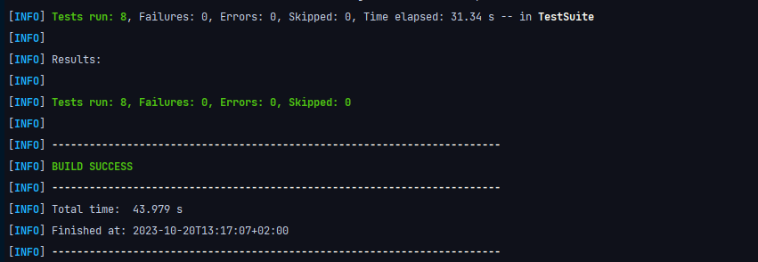
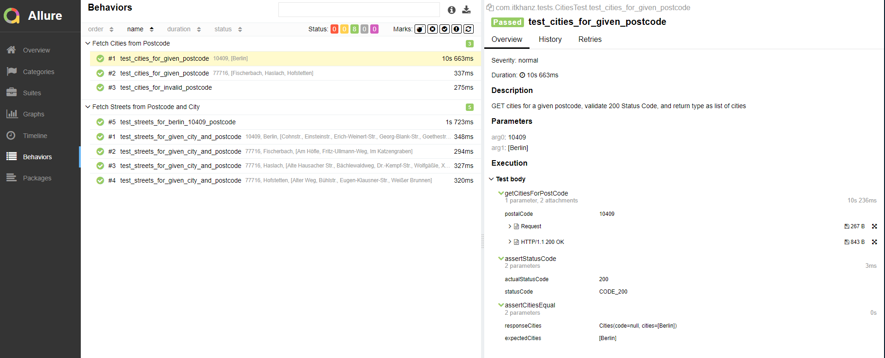

# API Testing with REST Assured and Java

[](https://github.com/itkhanz/RestAssured-API-Testing-Assignment/actions/workflows/test-execution.yml)

* This project is a solution for the API Testing assignment and automates API endpoints to validate the
  response.
* It uses data-driven testing to derive parameterized tests from JSON test data for both the test scenarios.
* API response is validated for HTTP Status code, response body, and content type.

## Pre-requisites

This project is built and tested with the following dependencies:

* JAVA JDK 17+ installed and JAVA_HOME set as environment variable
* MAVEN 3.9.2+ installed and MAVEN_HOME set as environment variable

## Tech Stack

* [Java 17](https://openjdk.org/projects/jdk/17/) as programming language
* [REST Assured](https://rest-assured.io/) Java DSL for easy testing of REST services
* [TestNG](https://mvnrepository.com/artifact/org.testng/testng/7.8.0) as testing framework to support the test creation
  and hooks
* [java-faker](https://github.com/DiUS/java-faker) as the faker data generation strategy
* [Log4j2](https://logging.apache.org/log4j/2.x/) as the logging management strategy
* [Owner](https://github.com/matteobaccan/owner) to minimize the code to handle properties files
* [Lombok](https://projectlombok.org/) to reduce the boilerplate and creating POJOs with builder pattern
* [jackson-databind](https://github.com/FasterXML/jackson-databind) to parse the JSON test data
* [Allure TestNG](https://github.com/allure-framework/allure-docs/blob/main/content/frameworks/java/testng.md) TestNG
  adapter for allure reporting
* [Allure rest-assured](https://mvnrepository.com/artifact/io.qameta.allure/allure-rest-assured) Filter for rest-assured
  http client, that generates attachment for allure.
* [GitHub Actions](https://docs.github.com/en/actions) for running tests via Continuous Integration (CI)
* [GitHub Pages](https://github.com/marketplace/actions/allure-report-with-history) for publishing the allure report via CI

## Project Structure

```shell
.
└── doc/
    ├── src/
    │   ├── main/
    │   │   └── resources/
    │   │       └── log4j2.xml
    │   └── test/
    │       ├── java/
    │       │   └── com/
    │       │       └── itkhanz/
    │       │           ├── api/
    │       │           │   ├── CitiesApi
    │       │           │   └── StreetsApi
    │       │           ├── config/
    │       │           │   └── owner/
    │       │           │       ├── ConfigFactory
    │       │           │       └── GeneralConfig
    │       │           ├── constants/
    │       │           │   ├── enums/
    │       │           │   │   ├── City
    │       │           │   │   └── StatusCode
    │       │           │   ├── Globals
    │       │           │   └── Route
    │       │           ├── factories/
    │       │           │   ├── FakerFactory
    │       │           │   └── TestDataLoader
    │       │           ├── models/
    │       │           │   └── pojos/
    │       │           │       ├── Cities
    │       │           │       ├── CityStreets
    │       │           │       └── StreetsRoot
    │       │           ├── specs/
    │       │           │   ├── CitiesSpecBuilder
    │       │           │   └── StreetsSpecBuilder
    │       │           ├── tests/
    │       │           │   ├── CitiesTest
    │       │           │   └── StreetsTest
    │       │           └── utils/
    │       │               ├── AssertionUtils
    │       │               └── JacksonUtils
    │       └── resources/
    │           ├── test-data/
    │           │   ├── cities.json
    │           │   └── streets.json
    │           ├── test-suites/
    │           │   └── testng.xml
    │           ├── allure.properties
    │           └── general.properties
    ├── target
    └── pom.xml
```

## Test Scenarios

### User story A – Address checks

AS             A backend developer

I WANT TO       find city and street names for a particular German postcode

SO THAT         I can help customers select their address details more easily

### Scenario 1: Find the cities for a given postcode

### Scenario 2: Find the streets for a given postcode

## Running Tests

* Clone the repo
* Open the project `POM.xml` in IDE of your choice and run the maven build that will download and install the required
  dependencies.
    * IntelliJ IDE is recommended.
* Use IDE Terminal or navigate to the project root directory and run following command in terminal:

```shell
mvn clean test
```

* It will run the whole regression suite comprising of 08 test cases split between 2 test classes.
* Results will be available in terminal after the build is finished.



## Test Reporting

* HTML report is generated by mavens surefire plugin, and is available at `target/surefire-reports/index.html`

### Allure Reports Setup

* Allure Report requires a web server to view the results. If we directly open the index.html file, we won't see any
  reports. To install Allure, first download and install Scoop/brew and then install allure using it.
* Follow the instructions for [Allure Report Installation](https://allurereport.org/docs/gettingstarted/installation/)
    * Install via Homebrew (for macOS and Linux)
        * Make sure Homebrew is installed.
  ```shell
  brew install allure
  ```
    * Install via Scoop (for Windows)
        * Make sure [Scoop](https://scoop.sh/) is installed.
  ```shell
  scoop install allure
  ```
* `allure --version` will show the version of allure downloaded and installed


* Allure HTML report is generated by allure, and is available at `target/allure-results/`
    * To view the allure report, run the command `allure serve target/allure-results` which will open the HTML report in
      your browser.
    * Allure report contains the request and response body as attachment.
        * To populate the request payload, and response body in allure report, we can use the `.filter(new
          AllureRestAssured())` method in our request and response specifications.
    * It also shows the test description, use story, and test steps in the test body.

> Before executing the tests again, stop the allure pressing Ctrl + c.



## Continuous Integration CI with GitHub Actions

* This project has a GitHub
  Action [workflow](https://github.com/itkhanz/RestAssured-API-Testing-Assignment/blob/main/.github/workflows/test-execution.yml)
  that triggers REST Assured API tests on each push or pull request to the main branch on Ubuntu VM.
* It caches the maven dependencies to save the build and run time.
* It then uploads the allure-results as test artifact and publishes the allure report to GitHub Pages.
* Published allure report can be found on GitHub Pages site: https://itkhanz.github.io/RestAssured-API-Testing-Assignment/

